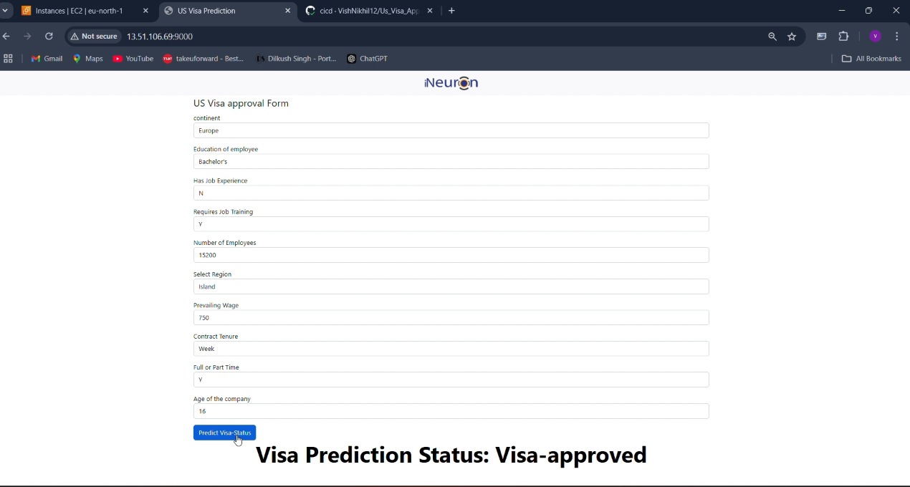

# US-Visa-Approval-Prediction

## About the Project

This is a client-based project developed at **i-Neuron** where I actively participated as part of the team. The project leverages advanced machine learning techniques to predict US visa approvals. It is designed to assist stakeholders in making informed decisions by providing reliable visa prediction outcomes.

## Media Gallery

- **ScreenShot**  
  

- ## Demo Video

Please [click here to view the demo video](assets/video/project_demo_video.mp4).

## MLOps Architecture Flowcharts

The following flowcharts represent each component of our MLOps architecture.

### Component 1: Data Ingestion
  
*Diagram showing the data ingestion process.*

### Component 2: Data Transformation
  
*Diagram outlining the data transformation workflow.*

### Component 3: Data Validation
  
*Diagram showing the data validation process.*

### Component 4: Model Evaluation
  
*Diagram illustrating the model evaluation workflow.*

### Component 5: Model Pusher
  
*Diagram showing the model pusher process.*

### Component 6: Model Trainer
  
*Diagram illustrating the model training workflow.*

## Table of Contents

- [Installation](#installation)
- [Usage](#usage)
- [Workflow](#workflow)
- [Environment Variables](#environment-variables)
- [AWS CICD Deployment with GitHub Actions](#aws-cicd-deployment-with-github-actions)
- [License](#license)
- [Contact](#contact)

## Installation

### Clone the Repository

```bash
git clone https://github.com/VishNikhil01/Us_Visa_Approval_Prediction
cd US-Visa-Approval-Prediction


## Git commands

```bash
git add .

git commit -m "Updated"

git push origin main
```

## How to run?

```bash
conda create -n visa python=3.8 -y
```

```bash
conda activate visa
```

```bash
pip install -r requirements.txt
```

```bash
python app.py
```


## Workflow

1. constant
2. config_entity
3. artifact_entity
4. conponent
5. pipeline
6. app.py / demo.py


### Export the  environment variable
```bash


export MONGODB_URL="mongodb+srv://<username>:<password>...."

export AWS_ACCESS_KEY_ID=<AWS_ACCESS_KEY_ID>

export AWS_SECRET_ACCESS_KEY=<AWS_SECRET_ACCESS_KEY>
```


# AWS-CICD-Deployment-with-Github-Actions

## 1. Login to AWS console.

## 2. Create IAM user for deployment

	#with specific access

	1. EC2 access : It is virtual machine

	2. ECR: Elastic Container registry to save your docker image in aws


	#Description: About the deployment

	1. Build docker image of the source code

	2. Push your docker image to ECR

	3. Launch Your EC2 

	4. Pull Your image from ECR in EC2

	5. Lauch your docker image in EC2

	#Policy:

	1. AmazonEC2ContainerRegistryFullAccess

	2. AmazonEC2FullAccess

	
## 3. Create ECR repo to store/save docker image
    - Save the URI: 136566696263.dkr.ecr.us-east-1.amazonaws.com/mlproject

	
## 4. Create EC2 machine (Ubuntu) 

## 5. Open EC2 and Install docker in EC2 Machine:
	
	
	#optinal

	sudo apt-get update -y

	sudo apt-get upgrade
	
	#required

	curl -fsSL https://get.docker.com -o get-docker.sh

	sudo sh get-docker.sh

	sudo usermod -aG docker ubuntu

	newgrp docker
	
# 6. Configure EC2 as self-hosted runner:
    setting>actions>runner>new self hosted runner> choose os> then run command one by one


# 7. Setup github secrets:

   - AWS_ACCESS_KEY_ID
   - AWS_SECRET_ACCESS_KEY
   - AWS_DEFAULT_REGION
   - ECR_REPO

    